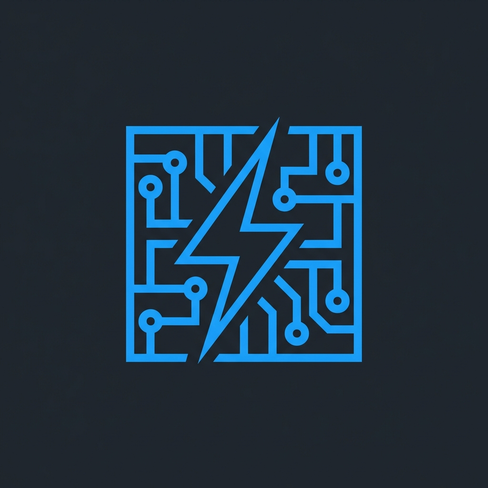

<div align="center">
  

  # FluxState
  
  **Advanced Real-Time Power & Thermal Simulation Architecture**
  
  [**Launch Simulator**](https://flux-state.vercel.app/)
  
  [](https://flux-state.vercel.app/)
  [](LICENSE)
  [](public/data/)

  <p align="center">
    A precision-engineered simulation engine for predicting PC hardware behavior.<br>
    Models transient power spikes, thermal equilibrium, and efficiency losses in real-time.
  </p>
</div>

---

## ⚡ System Architecture

FluxState is not a simple calculator. It is a **state-driven physics engine** running directly in the browser. It simulates the complex interplay between component power states, thermal dissipation, and electrical efficiency.

| Core Engine | Capabilities |
|:--- |:--- |
| **Transient Analysis** | Models micro-second power excursions (spikes) up to **1.9x TDP** based on oscilloscope data. |
| **Thermal Physics** | Calculates equilibrium temperatures using delta-T equations, cooler TDP, and ambient airflow resistance. |
| **Efficiency Curves** | Simulates non-linear PSU efficiency losses across the entire load range (80+ Bronze to Titanium). |
| **Boost Algorithms** | Dynamically adjusts CPU/GPU power states based on selected workload (Idle vs. Rendering). |

## 🧠 Simulation Logic

The engine operates on a 60Hz loop, rigorously calculating the state of the system:

### 1. Power State Modeling
Components do not consume static power. FluxState models dynamic states:
- **CPU**: C-State (Idle) ⇄ All-Core Turbo (Render) ⇄ Mixed Load (Gaming)
- **GPU**: Core Clock ⇄ Memory Controller ⇄ Board Power Limits
- **VRM/RAM**: Calculated overhead based on module count and voltage

### 2. The Transient Problem
Modern GPUs (RTX 30/40 series, RX 6000/7000) exhibit aggressive power switching behavior. A card rated for 450W can draw **800W+** for 20ms.
> FluxState predicts these peak currents to prevent Over-Current Protection (OCP) shutdowns, warning you if your PSU lacks the capacitor headroom.

### 3. Thermal Equilibrium Equation
Final temperature is derived from a resistance network model:
```math
T_{junction} = T_{ambient} + P_{load} \times (R_{cooler} + R_{airflow})
```
Where $R_{airflow}$ is dynamically derived from your selected case fan configuration and static pressure optimization.

## 📊 Build Quality Grading

The system assigns a composite score (S-Tier to F-Tier) based on three critical vectors:

1.  **Efficiency Integrity (30%)**: Is the PSU operating in its peak efficiency curve (40-60% load)?
2.  **Thermal Headroom (40%)**: Distance from $T_{junction\_max}$ under worst-case load.
3.  **Transient Stability (30%)**: Available wattage headroom for millisecond-scale power spikes.

## 🛠️ Hardware Database

Our dataset is meticulously curated from:
- Manufacturer Datasheets (Intel ARK, AMD Specs, NVIDIA Whitepapers)
- Independent Lab Reviews (GamersNexus, TechPowerUp, Cybenetics)
- Verified Community Telemetry

> **Status**: Active Development. The database expands weekly. New architectures (Blackwell, RDNA 4) are prioritized upon specification release.

---

<div align="center">
  <sub>Built with Astro, Vanilla JS, and Physics. No React. No bloat.</sub>
</div>
